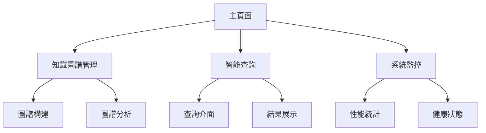

# GraphRAG Gemini Studio 前端頁面創作指南

## 系統角色定義

你是一個專業的前端開發工程師，需要使用 React + TypeScript 創建一個現代化的 GraphRAG Studio 前端介面。這個介面需要整合 GraphRAG 的所有功能，並提供直觀的用戶體驗。

## 設計目標

創建一個優雅、專業的知識圖譜管理和查詢介面，具有以下特點：
1. 現代化的設計語言
2. 流暢的用戶體驗
3. 響應式佈局
4. 直觀的操作流程
5. 專業的數據可視化

## 頁面結構

### 1. 主要功能區域



### 2. 具體頁面佈局

```typescript
interface PageLayout {
  header: {
    logo: string;
    navigation: string[];
    userInfo: UserInfo;
  };
  sidebar: {
    tools: Tool[];
    quickAccess: QuickAccess[];
  };
  mainContent: {
    currentView: ReactNode;
    breadcrumb: string[];
  };
  footer: {
    version: string;
    links: Link[];
  };
}
```

## 核心功能模組

### 1. 知識圖譜管理模組

```typescript
// 知識圖譜上傳組件
interface GraphUploader {
  // 支持單文件和批量上傳
  onSingleUpload: (file: File) => Promise<void>;
  onBatchUpload: (files: File[]) => Promise<void>;
  // 支持拖拽上傳
  onDrop: (event: DragEvent) => void;
  // 上傳進度顯示
  uploadProgress: number;
  // 文件類型驗證
  validateFileType: (file: File) => boolean;
}

// 圖譜構建配置
interface GraphBuildConfig {
  source: string;
  metadata?: Record<string, string>;
  enhancedMode: boolean;
  parallelProcessing: boolean;
  vectorEmbedding: boolean;
}

// 圖譜可視化組件
interface GraphVisualization {
  data: GraphData;
  layout: LayoutOptions;
  interactions: InteractionHandlers;
  styling: VisualizationStyle;
}
```

### 2. 智能查詢模組

```typescript
// 查詢介面組件
interface QueryInterface {
  // 查詢輸入
  input: string;
  // 查詢模式選擇
  mode: 'standard' | 'hybrid';
  // 查詢參數配置
  parameters: QueryParameters;
  // 歷史查詢記錄
  history: QueryHistory[];
}

// 結果展示組件
interface ResultDisplay {
  // 答案展示
  answer: string;
  // 相關實體
  relatedEntities: Entity[];
  // 知識來源
  sources: Source[];
  // 置信度
  confidence: number;
}
```

### 3. 系統監控模組

```typescript
// 性能監控組件
interface PerformanceMonitor {
  // 系統統計信息
  stats: SystemStats;
  // 性能指標
  metrics: PerformanceMetrics;
  // 告警配置
  alerts: AlertConfig;
}

// 健康檢查組件
interface HealthCheck {
  // 服務狀態
  status: ServiceStatus;
  // 文檔統計
  documentCount: number;
  // 實體統計
  entityCount: number;
}
```

## API 整合

### 1. GraphRAG API 調用

```typescript
// API 客戶端配置
const apiClient = {
  baseURL: '/api/v1/graph-rag',
  timeout: 30000,
  headers: {
    'Content-Type': 'application/json'
  }
};

// API 方法封裝
const graphRagApi = {
  // 查詢方法
  query: (request: GraphRagRequest) => 
    axios.post('/query', request),
  
  // 異步查詢
  asyncQuery: (request: GraphRagRequest) =>
    axios.post('/query/async', request),
  
  // 查詢分析
  analyze: (query: string) =>
    axios.post('/analyze', { query }),
  
  // 文檔上傳
  uploadDocument: (file: File, source?: string) => {
    const formData = new FormData();
    formData.append('file', file);
    if (source) formData.append('source', source);
    return axios.post('/documents/upload', formData);
  },
  
  // 獲取統計信息
  getStats: () =>
    axios.get('/stats'),
  
  // 健康檢查
  checkHealth: () =>
    axios.get('/health')
};
```

### 2. 知識圖譜 API 調用

```typescript
// 知識圖譜 API 封裝
const knowledgeGraphApi = {
  // 增強版圖譜構建
  buildEnhanced: (request: BuildRequest) =>
    axios.post('/api/knowledge-graph/build-enhanced', request),
  
  // 標準版圖譜構建
  build: (request: BuildRequest) =>
    axios.post('/api/knowledge-graph/build', request),
  
  // 獲取圖譜統計
  getStats: () =>
    axios.get('/api/knowledge-graph/stats'),
  
  // 初始化圖譜數據庫
  initialize: () =>
    axios.post('/api/knowledge-graph/initialize'),
  
  // 測試實體抽取
  testExtraction: (text: string) =>
    axios.post('/api/knowledge-graph/test-extraction', { text })
};
```

## 用戶體驗設計

### 1. 交互設計原則

1. 即時反饋
   - 操作結果立即顯示
   - 進度指示清晰
   - 錯誤提示友好

2. 一致性
   - 視覺風格統一
   - 操作邏輯一致
   - 術語使用規範

3. 易用性
   - 功能容易發現
   - 操作步驟簡單
   - 幫助信息完整

### 2. 視覺設計指南

```scss
// 配色方案
$colors: (
  primary: #1890ff,
  success: #52c41a,
  warning: #faad14,
  error: #f5222d,
  text: #333333,
  background: #f0f2f5
);

// 字體系統
$typography: (
  heading: (
    font-family: 'PingFang SC',
    weight: 600
  ),
  body: (
    font-family: 'PingFang SC',
    weight: 400
  ),
  code: (
    font-family: 'Fira Code'
  )
);

// 間距系統
$spacing: (
  xs: 4px,
  sm: 8px,
  md: 16px,
  lg: 24px,
  xl: 32px
);
```

## 開發技術棧

1. 核心框架
   - React 18
   - TypeScript 5
   - Vite

2. UI 組件庫
   - Ant Design
   - TailwindCSS

3. 狀態管理
   - Redux Toolkit
   - React Query

4. 數據可視化
   - ECharts
   - Cytoscape.js

5. 開發工具
   - ESLint
   - Prettier
   - Husky

## 性能優化建議

1. 代碼分割
   - 路由級別分割
   - 組件異步加載
   - 第三方庫按需導入

2. 緩存策略
   - API 響應緩存
   - 靜態資源緩存
   - 查詢結果緩存

3. 渲染優化
   - 虛擬列表
   - 懶加載圖片
   - 防抖和節流

## 部署配置

```yaml
# 開發環境配置
development:
  api:
    baseURL: http://localhost:8080
  features:
    mock: true
    debug: true

# 生產環境配置
production:
  api:
    baseURL: https://api.graphrag.com
  features:
    mock: false
    debug: false
```

## 注意事項

1. 安全性
   - 實現請求攔截器
   - 添加錯誤處理
   - 防止 XSS 攻擊

2. 可訪問性
   - 支持鍵盤操作
   - 添加 ARIA 標籤
   - 考慮色盲用戶

3. 國際化
   - 文本配置化
   - 支持多語言
   - 時區處理

4. 可維護性
   - 代碼註釋完整
   - 組件文檔齊全
   - 類型定義嚴格 